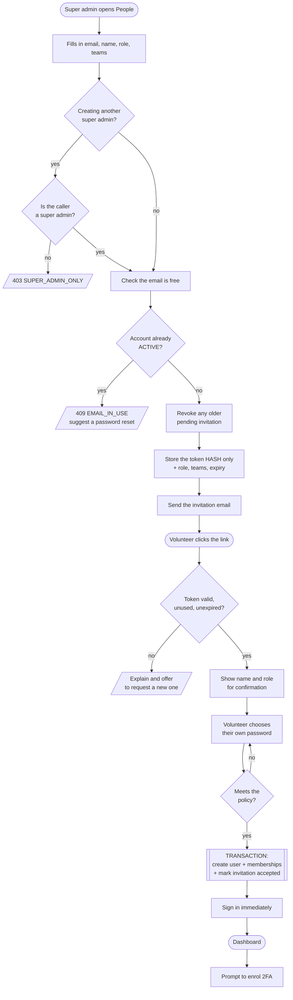
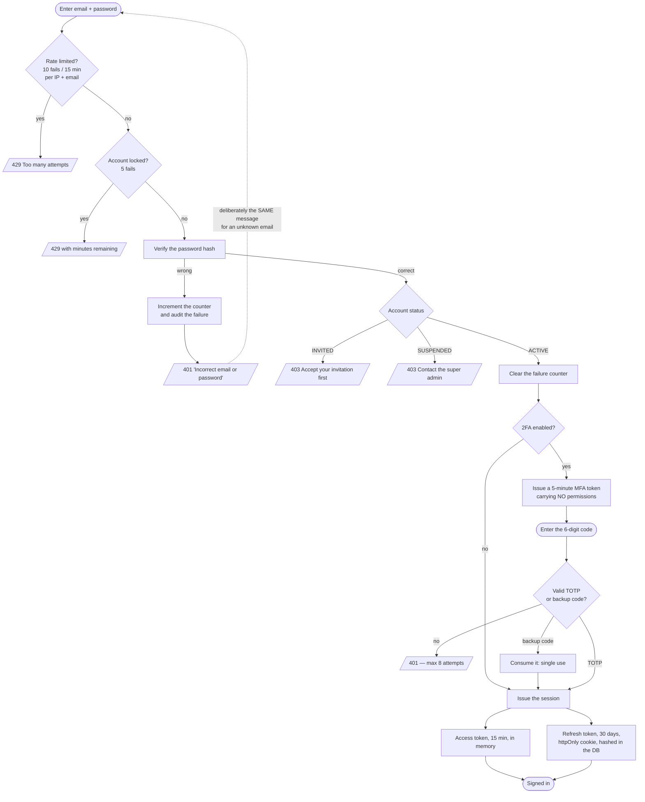
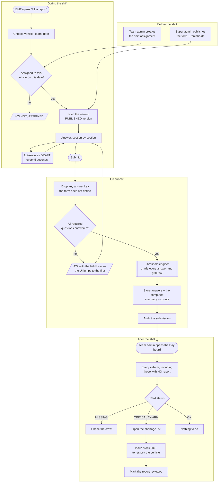
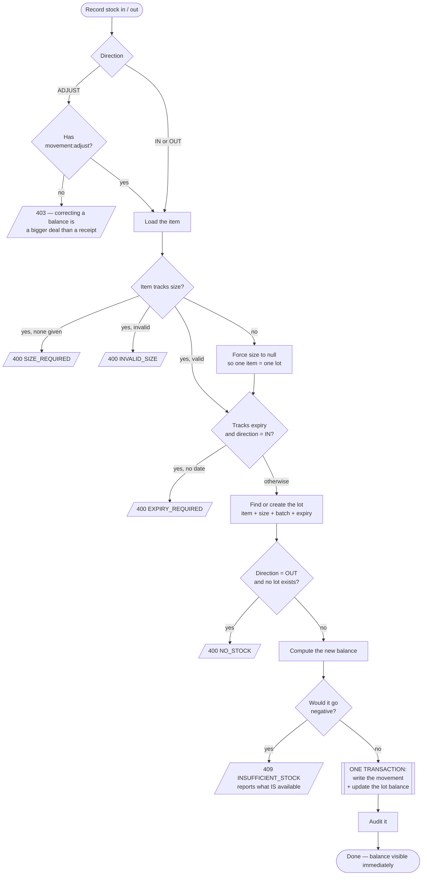
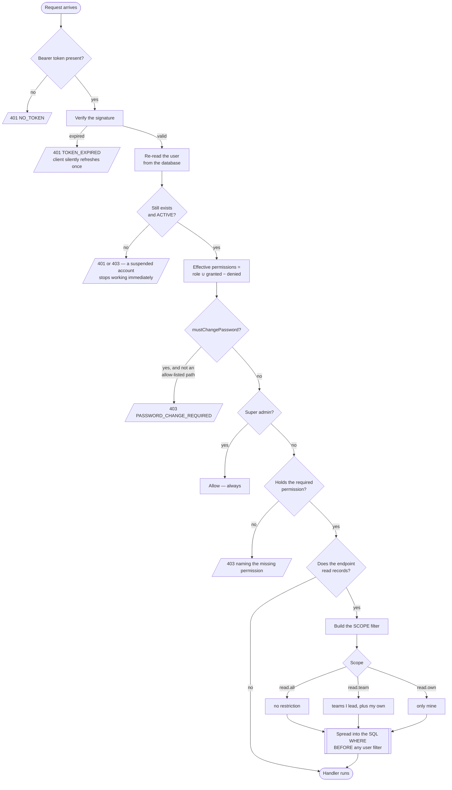
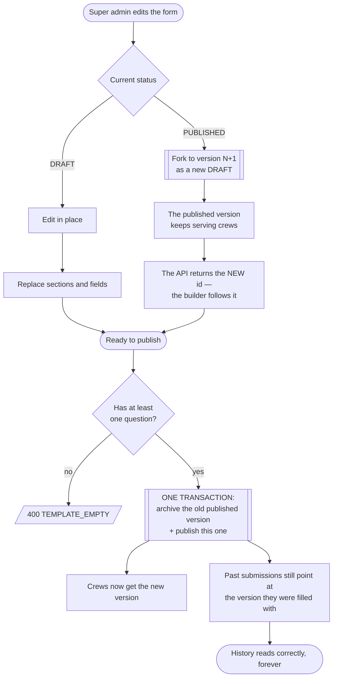

# 05 — Activity diagrams

Mermaid diagrams — they render directly on GitHub and in most Markdown viewers.

---

## 1. Onboarding a new volunteer

Note that **no password ever travels by email.** A password sent by email lives
in an inbox forever, is often reused elsewhere, and cannot be revoked. The
invitation carries a single-use token instead, and the person chooses their own
password on a page only that token can open.

---

## 2. Signing in

**Why the access token is not in `localStorage`:** any successful XSS can read
it in one line. A variable in a module closure cannot be reached that way, and
the httpOnly refresh cookie restores the session after a reload — so nothing is
lost.

---

## 3. Filling and acting on an equipment report

This is the loop the whole system exists for.

**The summary is computed once, at submit time, and stored.** So when the super
admin raises an expected quantity next month, last week's report still reads
against the rules that applied on the day it was filed. Recomputing on read
would silently rewrite history.

---

## 4. Recording a stock movement

**The invariant:** `StockLot.quantityOnHand` always equals the sum of that lot's
movements. It is a cache of the ledger, and it is only trustworthy because both
writes happen in the same transaction. Nothing outside `inventory.service.js`
may write it.

Movements are **immutable** — no edit, no delete. A mistake is corrected with a
compensating `ADJUST` row, so the ledger always explains itself.

---

## 5. How a permission decision is made

Two separate questions, and keeping them separate is the core of the design.

**Why permissions are re-read on every request** rather than embedded in the
JWT: if the super admin revokes someone's access, an embedded list would keep
working until the token expired. For a system whose entire purpose is that the
super admin is in charge, "revocation takes effect now" is worth one indexed
lookup.

**Why scope is a `WHERE` clause** and not a filter after loading: an
out-of-scope row is never selected, so it cannot leak through a forgotten check.
And an out-of-scope id returns **404, not 403** — a 403 would confirm the record
exists, which itself tells a team admin something about another team.

---

## 6. Publishing a change to the report form

Without versioning, raising "expected tourniquets" from 2 to 4 would turn every
past report red retroactively — reports that were correct on the day they were
filed. The transaction matters too: it guarantees there is never a moment with
two published versions of the same form, or none.
